# Video-Library-Management-System
A web application where users can watch embedded YouTube videos, and admins can add, edit, or delete videos. Includes user authentication and role-based access.
## Features

### For Users
- Register and login with a secure account.
- Browse and watch YouTube videos embedded in the platform.
- Search and filter videos by title or category.

### For Admin
- Add new videos with YouTube links.
- Edit or delete existing videos.
- Manage users (optional, if implemented).

---

## Screenshots

### Admin Screens
- **Admin Login:**  
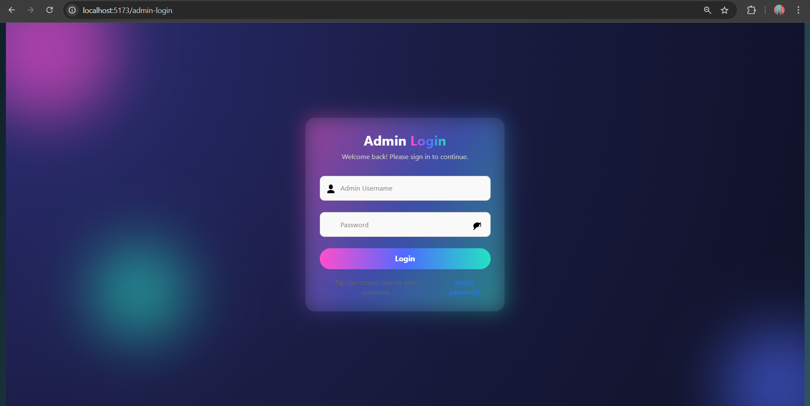  

- **Admin Dashboard:**  
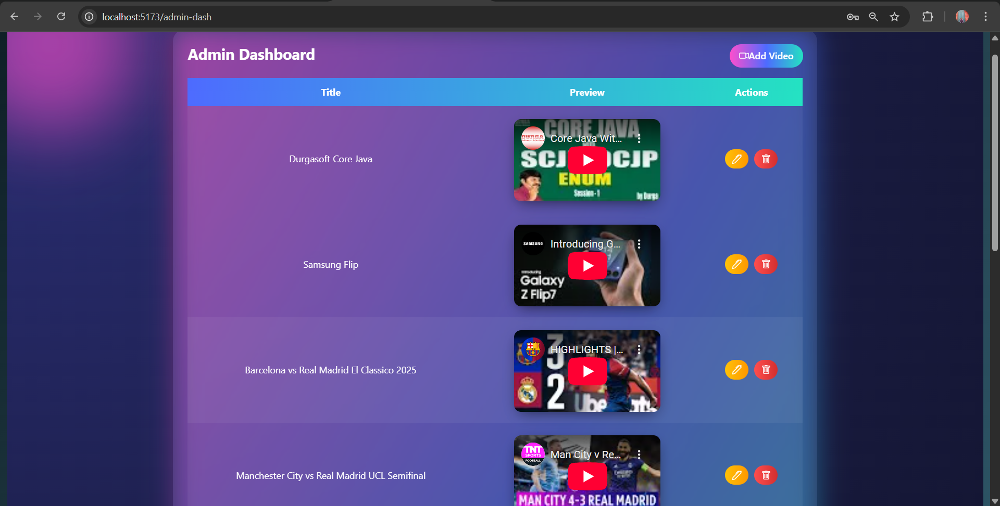  
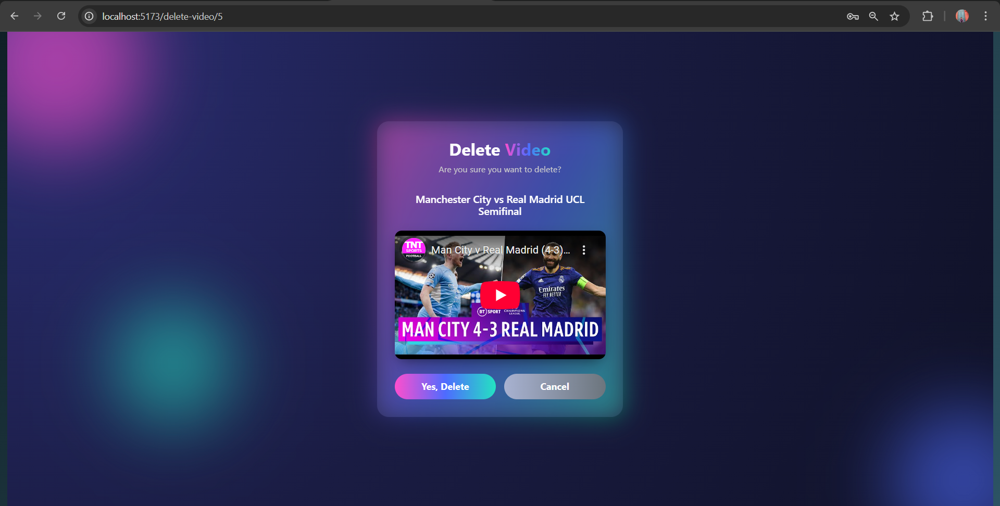  

- **Edit Video:**  
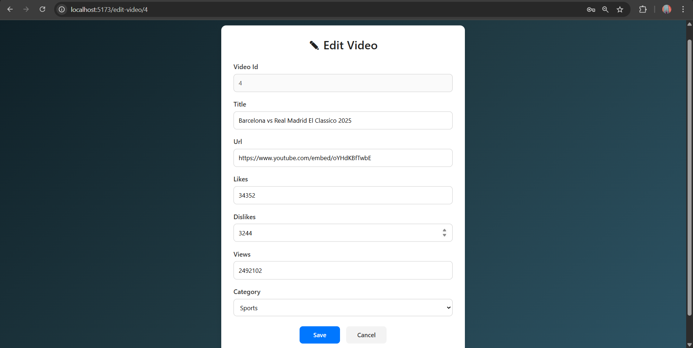  

### User Screens
- **User Login:**  
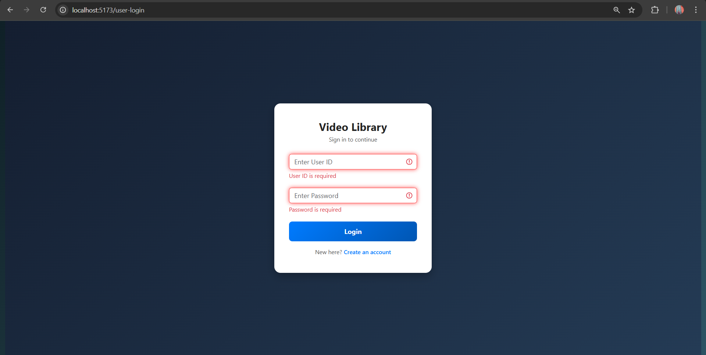  
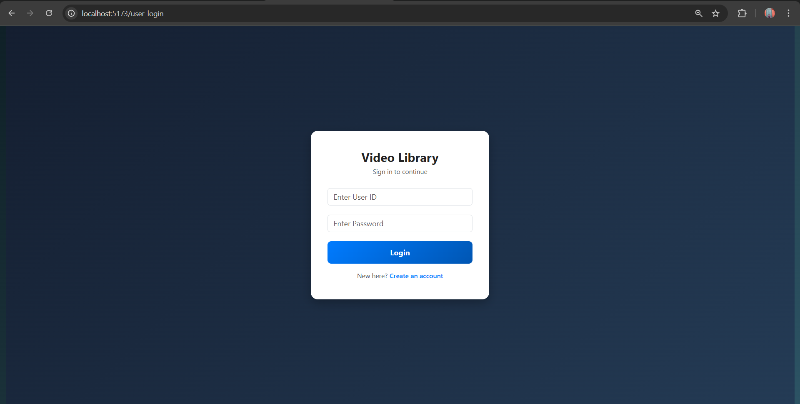  

- **User Dashboard:**  
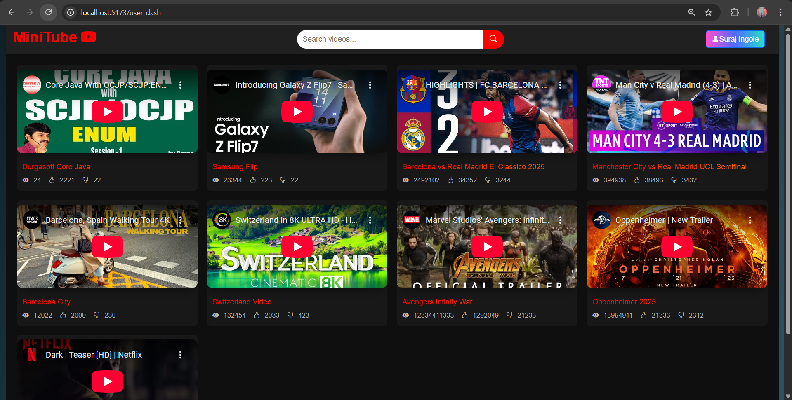  

- **Video Play Page:**  
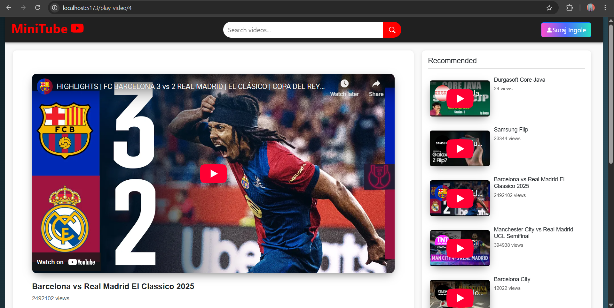  

- **Login Dashboard:**  
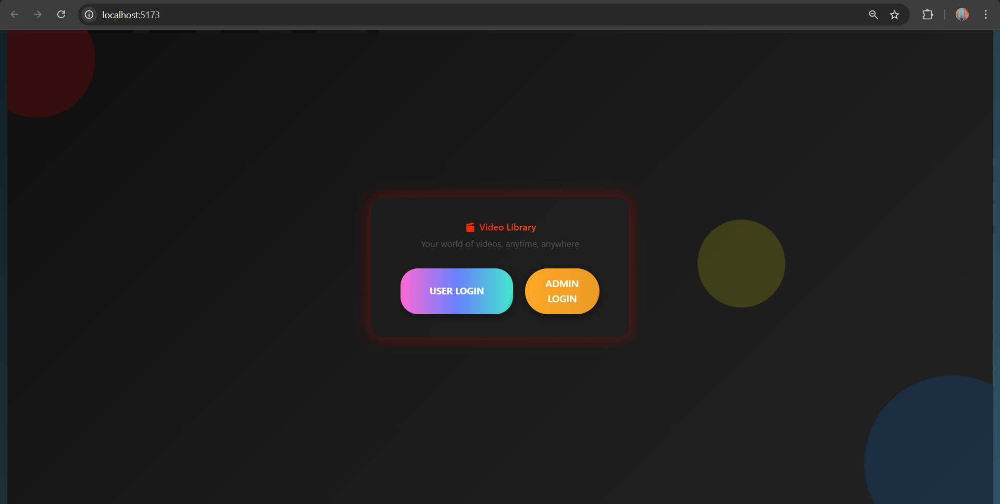  

- **User Profile:**  
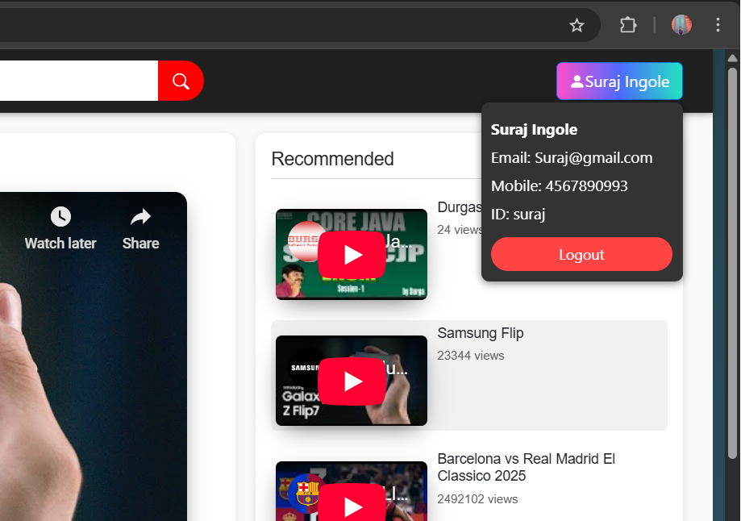  

- **Comment Section:**  
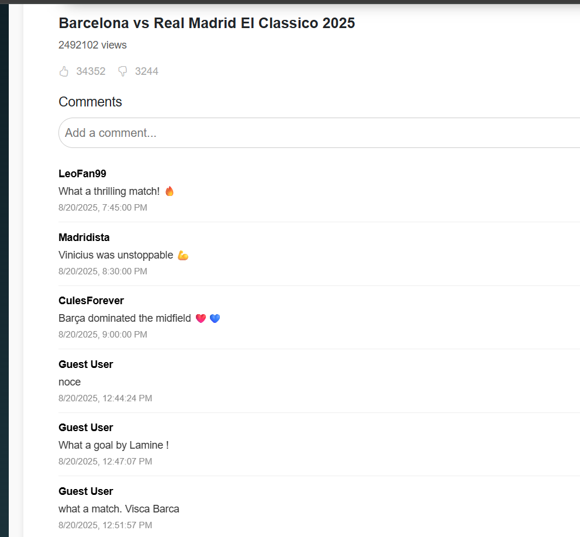  

## Technologies Used
- **Frontend:** React, React Router, Axios, CSS/Bootstrap  
- **Backend:** Node.js + Express (if backend exists)  
- **Database:** MongoDB / Firebase / Local JSON (depending on your setup)  
- **Version Control:** Git & GitHub  

